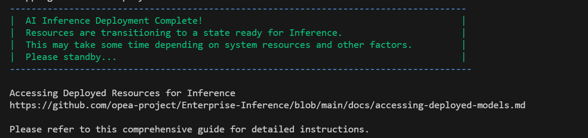
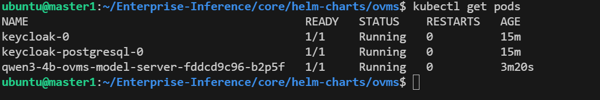

# OpenVINO Model Server (OVMS) on Intel Enterprise Inference - Single Node Deployment Guide

This guide provides step-by-step instructions to deploy Intel® AI for Enterprise Inference and deploying LLM models using OpenVINO Model Server (OVMS) on existing Enterprise-Inference cluster on a single node.

## Prerequisites
Before running the automation, complete all [prerequisites](./prerequisites.md).

## Deployment Steps

### Step 1: Modify the hosts file
Since we are testing locally, we need to map a fake domain (`api.example.com`) to `localhost` in the `/etc/hosts` file.

Run the following command to edit the hosts file:
```
sudo nano /etc/hosts
```
Add this line at the end:
```
127.0.0.1 api.example.com
```
Save and exit (`CTRL+X`, then `Y` and `Enter`).

### Step 2: Generate a self-signed SSL certificate
Run the following command to create a self-signed SSL certificate that covers api.example.com and trace-api.example.com:
```bash
mkdir -p ~/certs && cd ~/certs && \
openssl req -x509 -newkey rsa:4096 -keyout key.pem -out cert.pem -days 365 -nodes \
  -subj "/CN=api.example.com" \
  -addext "subjectAltName = DNS:api.example.com, DNS:trace-api.example.com"
```
Note: the -addext option requires OpenSSL >= 1.1.1.

Files produced:
- cert.pem — the self-signed certificate (contains SANs)
- key.pem — the private key

Important DNS step:
Please add trace-api.example.com to DNS and point it to the node where Ingress controller is deployed.

### Step 3: Configure the Automation config file
Move the single node preset inference config file to the runnig directory

```
cd ~
git clone https://github.com/opea-project/Enterprise-Inference.git
cd Enterprise-Inference
cp -f docs/examples/single-node/inference-config.cfg core/inventory/inference-config.cfg
```

### Step 4: Modify `inference-config.cfg` and set deploy_llm_models variable to off like this 

```
nano ~/Enterprise-Inference/core/inventory/inference-config.cfg

change  " deploy_llm_models=on " ->  " deploy_llm_models=off "

```

Ensure the `cluster_url` field is set to the DNS used, and the paths to the certificate and key files are valid. The keycloak fields and deployment options can be left unchanged. For systems behind a proxy, refer to the [proxy guide](./running-behind-proxy.md).

### Step 5: Update `hosts.yaml` File
Copy the single node preset hosts config file to the working directory:

```bash
cp -f docs/examples/single-node/hosts.yaml core/inventory/hosts.yaml
```

> **Note** The `ansible_user` field is set to *ubuntu* by default. Change it to the actual username used. 

Export the Hugging Face token as an environment variable by replacing "Your_Hugging_Face_Token_ID" with actual Hugging Face Token and run the automation script using the configured files.

```bash
export HUGGINGFACE_TOKEN=<<Your_Hugging_Face_Token_ID>>

cd core
chmod +x inference-stack-deploy.sh

./inference-stack-deploy.sh --cpu-or-gpu "cpu" --hugging-face-token $HUGGINGFACE_TOKEN
```

**Select Option 1 and confirm the Yes/No prompt.**

This will deploy the setup automatically. If any issues are encountered, double-check the prerequisites and configuration files

Once the cluster setup is done, you can see completion message
 

you can now move to next step

### Step 6: Edit the `values.yaml` File

#### OIDC Configuration

**NOTE: you need to get keycloak clientId and clientSecret as shown below before configuring OIDC**

-------------------------------  **IMPORTANT**  -------------------------------
### The below echo commands will print Keycloak ID and secret.          ###  
### Note down the printed values to replace in values.yaml.             ###
---------------------------------------------------------------------------

```
cd ~/Enterprise-Inference/core/scripts
source generate-token.sh

cd ~/Enterprise-Inference/core/helm-charts/ovms/

echo $KEYCLOAK_CLIENT_ID         # this will print your keycloak client ID that can be used in above OIDC configuration
echo $KEYCLOAK_CLIENT_SECRET     # this will print your keycloak client secret that can be used in above OIDC configuration
```

Configure OpenID Connect authentication with your Keycloak instance, open the `values.yaml` file and configure the following parameters:

open the file as

From Terminal -> **nano ~/Enterprise-Inference/core/helm-charts/ovms/values.yaml**

In VSCode -> **code ~/Enterprise-Inference/core/helm-charts/ovms/values.yaml**

```yaml
oidc:
  enabled: true
  realm: master
  clientId: "<<replace with your KEYCLOAK_CLIENT_ID>>"                   # Update this with keycloak client ID value you got above
  clientSecret: "<<replace with your KEYCLOAK_CLIENT_SECRET>>"           # Update this with keycloak client secret value you got above
  discovery: "http://keycloak.default.svc.cluster.local/realms/master/.well-known/openid-configuration"
  introspectionEndpoint: "http://keycloak.default.svc.cluster.local/realms/master/protocol/openid-connect/token/introspect"
```

#### Host Configuration

Set your domain/hostname:

```yaml
apisixRoute:
  enabled: true
  namespace: default
  name: ""
  host: "api.example.com"  # Update this

ingress:
  enabled: true
  className: nginx
  namespace: auth-apisix
  host: "api.example.com"  # Update this (same as above)
  secretname: "api.example.com"  # (your TLS secret name)
```
---

## Deploying OpenVINO LLM models

**NOTE: to deploy more than one model to the cluster make sure you have enough CPU resources, recommended CPU >=32 Cores,**
**by default each model deployed is assigned 12 CPU cores, if you want to change it you can do via helm --set options. Refer advanced configuration section below**

Below are the example models and the respective Helm commands to deploy [supported models](https://openvinotoolkit.github.io/openvino.genai/docs/supported-models/)

For Deploying `Qwen3-4B-int4-ov` model:
```bash
cd ~/Enterprise-Inference/core/helm-charts/ovms/
helm install qwen3-4b . --set modelSource="OpenVINO/Qwen3-4B-int4-ov" --set modelName="qwen3-4b"
```
 
For Deploying `Mistral-7B-Instruct-v0.3-int4-cw-ov` model:
```bash
cd ~/Enterprise-Inference/core/helm-charts/ovms/
helm install mistral-7b . --set modelSource="OpenVINO/Mistral-7B-Instruct-v0.3-int4-cw-ov" --set modelName="mistral-7b"
```
For Deploying `meta-llama/Llama-3.2-3B-Instruct` model:
```bash
cd ~/Enterprise-Inference/core/helm-charts/ovms/
helm install llama-3b . --set modelSource="meta-llama/Llama-3.2-3B-Instruct" --set modelName="llama-3.2-3b-instruct" --set huggingface.token=$HUGGINGFACE_TOKEN
```

**Note:** Model download may take 5-10 minutes depending on model size and network speed.

### Accessing the deployed models and testing

First, obtain an access token:

```bash
cd ~/Enterprise-Inference/core/scripts
source generate-token.sh
cd -

export CLIENTID=$KEYCLOAK_CLIENT_ID 
export CLIENT_SECRET=$KEYCLOAK_CLIENT_SECRET
export BASE_URL=https://api.example.com
export TOKEN_URL=${BASE_URL}/token
export TOKEN=$(curl -k -X POST ${TOKEN_URL} -H 'Content-Type: application/x-www-form-urlencoded' -d "grant_type=client_credentials&client_id=${CLIENTID}&client_secret=${CLIENT_SECRET}" | jq -r .access_token)

echo "Access Token: $TOKEN"
```

### Test via External URL (with Authentication)

```bash
# Test chat completions endpoint
For Inferencing with Qwen3-4B-int4-ov:
curl -k ${BASE_URL}/qwen3-4b-ovms/v3/chat/completions -X POST -d '{"messages": [{"role": "system","content": "You are helpful assistant"},{"role": "user","content": "what is photosynthesis"}],"model": "qwen3-4b","max_tokens": 32,"temperature": 0.4}' -H 'Content-Type: application/json' -sS -H "Authorization: Bearer $TOKEN"

For Inferencing with Mistral-7B-Instruct-v0.3-int4-cw-ov:
curl -k ${BASE_URL}/mistral-7b-ovms/v3/chat/completions -X POST -d '{"messages": [{"role": "system","content": "You are helpful assistant"},{"role": "user","content": "what is photosynthesis"}],"model": "mistral-7b","max_tokens": 32,"temperature": 0.4}' -H 'Content-Type: application/json' -sS -H "Authorization: Bearer $TOKEN"

For Inferencing with meta-llama/Llama-3.2-3B-Instruct:
curl -k ${BASE_URL}/llama-3.2-3b-instruct/v3/chat/completions -X POST -d '{"messages": [{"role": "system","content": "You are helpful assistant"},{"role": "user","content": "what is api"}],"model": "llama-3.2-3b-instruct","max_tokens": 32,"temperature": 0.4}' -H 'Content-Type: application/json' -sS -H "Authorization: Bearer $TOKEN"

```
---
## Undeployment

### Complete Removal

To completely remove the deployment:

```bash
# Uninstall the Helm release
helm uninstall qwen3-4b
helm uninstall mistral-7b
helm uninstall llama-3b

# Verify removal to confirm all model related resources are deleted
helm list
kubectl get pods -l app=ovms-model-server
kubectl get svc -l app=ovms-model-server
kubectl get apisixroute -n default
kubectl get ingress -n auth-apisix
```

## Advanced Configuration

### Deploy Multiple Models

To deploy multiple models and with different options:

```bash
# Deploy Qwen3-8B
helm install qwen3-8b . \
  --set modelSource="OpenVINO/Qwen3-8B-int4-ov" \
  --set modelName="qwen3-8b" \
  --set model.task="text_generation" \
  --set model.initResources.requests.cpu="8"
  --set model.initResources.limits.cpu="8"

# Deploy Qwen3-4B
helm install qwen3-4b . \
  --set modelSource="OpenVINO/Qwen3-4B-int4-ov" \
  --set modelName="qwen3-4b" \
  --set model.initResources.requests.cpu="8"
  --set model.initResources.limits.cpu="8"
``` 
