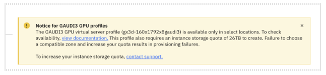
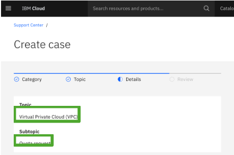
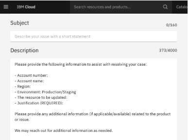

# Quota Increase for Gaudi 3 - IBM Cloud Quick Start Guide

## Problem:
When attempting to provision a Gaudi 3 Virtual Server Instance (VSI), you may encounter the following error: 
```
"over_quota" 
"A non-dedicated host VSI with this profile (XXX vCPUs) will put user over quota….” 
```

You may also see the following alert when going through the provisioning steps:  


## Solution:
To successfully provision a single Gaudi 3 node, your IBM Cloud account must have the following minimum resource quotas: 

1. **vCPUs**: 160 
2. **Memory**: 1792 GiB 
3. **Instance Storage**: 26 TB 
4. **GPUs**: 8 

If you’d like to provision more than one Gaudi 3 node (8 Gaudi 3 AI Accelerators) under the same IBM Cloud Account, multiply the above values by the number of nodes. 

### Example: Provisioning 2 nodes of Gaudi 3 would require a minimum quota of: 

1. **vCPUs**: 320 (160 x 2) 
2. **Memory**: 3584 GiB (1792 x 2)  
3. **Instance Storage**: 52 TB (26 x 2)  
4. **GPUs**: 16 (8 x 2)  

## Steps to Request a Quota Increase

Familiarize yourself with this documentation: Increasing Account Limits –  [IBM Cloud Documentation](https://cloud.ibm.com/docs/account?topic=account-account-limits&interface=cli)

Follow this link, [Opening a Support Case](https://cloud.ibm.com/unifiedsupport/cases/add) , to open the IBM Cloud Console and find the appropriate page.  

Fill in the support request
1. For ‘Topic’, choose ‘Virtual Private Cloud (VPC)’ 
2. For ‘Subtopic’, choose ‘Quota request’ 
	
3. For ‘Subject’, type a title that best describes your ask; e.g., “Requesting quota increase for Gaudi 3 resources” 
4. For ‘Description’, fill in the requested information based on your specific use case and needs
   - Account number: XXX 
   - Account name: XXX 
   - Region: XXX 
   - Environment: ‘Production’  
   - Justification REQUIRED: XXX 
   
5. Fill out any additional information pertinent to the support case, then click ‘Next’. 
6. On the next page, review the support case and click ‘Submit case’ when finished. 
7. Reach out to your IBM Tech Seller with the IBM Support Ticket Number. Your Tech Seller will then reach out to the Product Team to expedite the completion of the requested changes.  
8. Once the quota changes have been made to the IBM Cloud Account, the Tech Seller will notify the customer. Th customer can now provision the necessary Gaudi 3 resources.  